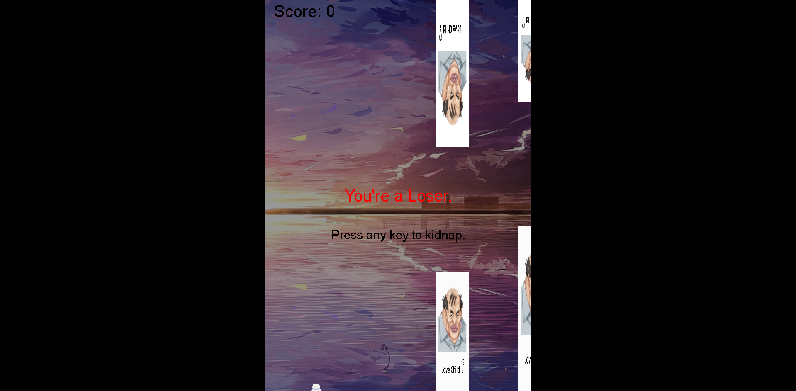

# Flappy-loli

<b>Dibuat menggunakan HTML, CSS dan JS</b>

 <h3>Cara menggunakan</h3>

 - Buka Command Prompt lalu salin repo ini.
  ```
  git clone https://github.com/Skinnoying/flappy-loli.git
  ```

## Keterangan :

saya sudah memberi keterangan pada kode (jadi kalian bisa memodifikasi sesuka kalian)

<b>Fitur :</b>

- Skor Game
- Game Over
- Suara Skor (berkelipatan 10)
- Suara Game Over

## Tampilan



## Donasi Saya

<a href="https://saweria.co/raiinime">

